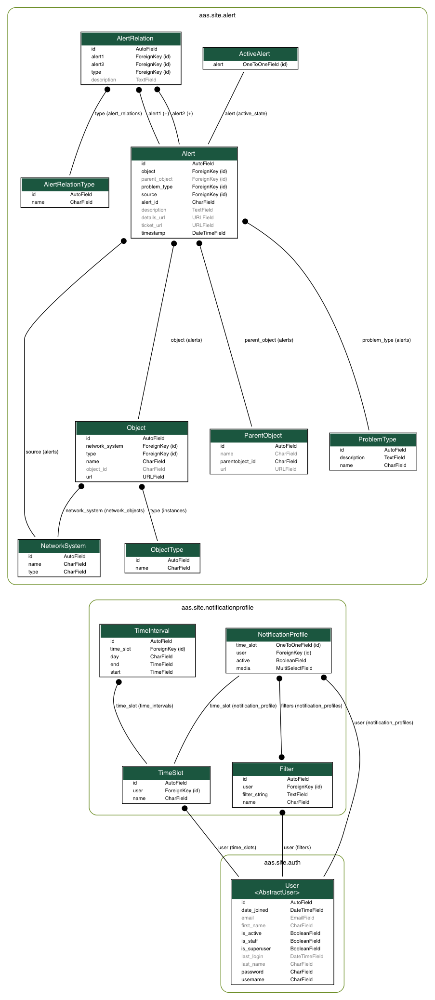

# Argus
[](https://github.com/Uninett/Argus/actions)
[](https://codecov.io/gh/Uninett/Argus)
[](https://github.com/psf/black)

Argus is a platform for aggregating incidents across network management systems, and sending notifications to users. Users build notification profiles that define which incidents they subscribe to.

This repository hosts the backend built with Django, while the frontend is hosted here: https://github.com/Uninett/Argus-frontend.


## Setup

### Prerequisites
* Python 3.6+
* pip

### Dataporten setup
* Register a new application with the following redirect URL: `{server_url}/oidc/complete/dataporten_feide/`
  * `{server_url}` must be replaced with the URL to the server running this project, like `http://localhost:8000`
* Add the following permission scopes:
  * `profile`
  * `userid`
  * `userid-feide`
* Create the text file `src/argus/site/settings/dataporten_secret.txt` containing the client key to the application

### Project setup
* Create a Python 3.6+ virtual environment
* `pip install -r requirements.txt`
* `python manage.py migrate`

Start the server with `python manage.py runserver`.

### Site- and deployment-specific settings

Site-specific settings are set as per 12 factor, with environment variables. For more details, see the relevant section in the docs: [Setting site-specific settingsi](https://argus.readthedocs.io/en/latest/site-specific-settings.html).

A recap of the environment variables that can be set by default follows.

#### Environment variables

* DEBUG, 1 for True, 0 for False
* TEMPLATE_DEBUG. By default set to the same as DEBUG.
* ARGUS_DATAPORTEN_SECRET, which holds the password for using dataporten for
  authentication.
* ARGUS_FRONTEND_URL, by default "http://localhost:3000", for CORS
* EMAIL_HOST, smarthost (domain name) to send email through
* EMAIL_HOST_PASSWORD, password if the smarthost needs that
* EMAIL_PORT, in production by default set to 587
* SECRET_KEY, used internally by django, should be about 50 chars of ascii
  noise (but avoid backspaces!)

*A Gmail account with "Allow less secure apps" turned on, was used in the development of this project.*

### Running tests
* `python manage.py test src`


## Endpoints
*`/admin/` to access the project's admin pages.*

All endpoints require requests to contain a header with key `Authorization` and value `Token {token}`, where `{token}` is replaced by a registered auth token; these are generated per user by logging in through Feide, and can be found at `/admin/authtoken/token/`.

<details>
<summary>Auth endpoints</summary>

* `GET` to `/api/v1/auth/user/`: returns the logged in user
* `POST` to `/oidc/api-token-auth/`: returns an auth token for the posted user
  * Body: `{ username: <username>, password: <password> }`
* `/oidc/login/dataporten_feide/`: redirects to Feide login
</details>

<details>
<summary>Incident endpoints</summary>

* `/api/v1/incidents/`:
  * `GET`: returns all incidents - both active and historic
    <details>
    <summary>Example response body:</summary>

    ```json
    [
        {
            "pk": 10101,
            "timestamp": "2011-11-11T11:11:11+02:00",
            "source": {
                "pk": 11,
                "name": "Uninett GW 3",
                "type": {
                    "name": "NAV"
                },
                "user": 12
            },
            "source_incident_id": "12345",
            "object": {
                "pk": 11,
                "name": "Netbox 4",
                "object_id": "112233",
                "url": "https://uninett.no/api/objects/112233/",
                "type": {
                    "pk": 1,
                    "name": "Netbox"
                }
            },
            "parent_object": {
                "pk": 5,
                "name": "SuperNetbox",
                "parentobject_id": "445566",
                "url": "https://uninett.no/api/objects/445566/"
            },
            "details_url": "https://uninett.no/api/alerts/12345/",
            "problem_type": {
                "pk": 1,
                "name": "boxDown",
                "description": "Box declared down."
            },
            "description": "Netbox 11 <1234> down.",
            "ticket_url": "https://tickettracker.com/tickets/987654/",
            "active_state": true
        }
    ]
    ```
    </details>
  * `POST`: creates and returns an incident
    <details>
    <summary>Body:</summary>

    Attribute explanation: https://nav.uninett.no/doc/dev/reference/eventengine.html#exporting-alerts-from-nav-into-other-systems
    ```json
    {
        "id": 212310,
        "history": 196179,
        "time": "2019-11-05T10:03:10.235877",
        "message": "box down example-sw.example.org 10.0.1.42",
        "source": "pping",
        "state": "s",
        "on_maintenance": false,
        "netbox": 138,
        "device_groups": null,
        "device": null,
        "subid": "",
        "subject_type": "Netbox",
        "subject": "example-sw.example.org",
        "subject_url": "/api/v1/ipdevinfo/example-sw.example.org/",
        "alert_details_url": "/api/v1/alerts/196179/",
        "netbox_history_url": "/api/v1/devicehistory/history/%3Fnetbox=138",
        "event_history_url": "/api/v1/devicehistory/history/?eventtype=e_boxState",
        "event_type": {
            "description": "Tells us whether a network-unit is down or up.",
            "id": "boxState"
        },
        "alert_type": {
            "description": "Box declared down.",
            "name": "boxDown"
        },
        "severity": 50,
        "value": 100
    }
    ```
    </details>

* `GET` to `/api/v1/incidents/<int:pk>`: returns an incident by pk
* `GET` to `/api/v1/incidents/active/`: returns all active incidents
* `PUT` to `/api/v1/incidents/<int:pk>/active`: changes an incident's active state by pk
  * Body: `{ "active": <bool> }`
* `GET` to `/api/v1/incidents/metadata/`: returns relevant metadata for all incidents

</details>

<details>
<summary>Notification profile endpoints</summary>

* `/api/v1/notificationprofiles/`:
  * `GET`: returns the logged in user's notification profiles
  * `POST`: creates and returns a notification profile which is then connected to the logged in user
    <details>
    <summary>Body:</summary>

    ```json
    {
        "timeslot": 1,
        "filters": [
            1,
            2
        ],
        "media": [
            "EM",
            "SM"
        ],
        "active": true
    }
    ```
    </details>

* `/api/v1/notificationprofiles/<int:pk>`:
  * `GET`: returns one of the logged in user's notification profiles by pk
  * `PUT`: updates and returns one of the logged in user's notification profiles by pk
    * Body: same as `POST` to `/api/v1/notificationprofiles/`
  * `DELETE`: deletes one of the logged in user's notification profiles by pk

* `GET` to `/api/v1/notificationprofiles/<int:pk>/incidents/`: returns all incidents - both active and historic - filtered by one of the logged in user's notification profiles by pk

* `/api/v1/notificationprofiles/timeslots/`:
  * `GET`: returns the logged in user's time slots
  * `POST`: creates and returns a time slot which is then connected to the logged in user
    <details>
    <summary>Body:</summary>

    ```json
    {
        "name": "Weekdays",
        "time_recurrences": [
            {
                "days": [1, 2, 3, 4, 5],
                "start": "08:00:00",
                "end": "12:00:00"
            },
            {
                "days": [1, 2, 3, 4, 5],
                "start": "12:30:00",
                "end": "16:00:00"
            }
        ]
    }
    ```

    The optional key `"all_day"` indicates that Argus should use `Time.min` and `Time.max` as `"start"` and `"end"` respectively. This also overrides any provided values for `"start"` and `"end"`. An example request body:
    ```json
    {
        "name": "Immediately",
        "time_recurrences": [
            {
                "days": [1, 2, 3, 4, 5, 6, 7],
                "all_day": true
            }
        ]
    }
    ```
    which would yield the response:
    ```json
    {
        "pk": 2,
        "name": "Immediately",
        "time_recurrences": [
            {
                "days": [1, 2, 3, 4, 5, 6, 7],
                "start": "00:00:00",
                "end": "23:59:59.999999",
                "all_day": true
            }
        ]
    }
    ```
    </details>

* `/api/v1/notificationprofiles/timeslots/<int:pk>`:
  * `GET`: returns one of the logged in user's time slots by pk
  * `PUT`: updates and returns one of the logged in user's time slots by pk
    * Body: same as `POST` to `/notificationprofiles/timeslots/`
  * `DELETE`: deletes one of the logged in user's time slots by pk

* `/api/v1/notificationprofiles/filters/`:
  * `GET`: returns the logged in user's filters
  * `POST`: creates and returns a filter which is then connected to the logged in user
    <details>
    <summary>Body:</summary>

    ```json
    {
        "name": "Critical incidents",
        "filter_string": "{\"sourceIds\":[<SourceSystem.pk>, ...], \"objectTypeIds\":[<ObjectType.pk>, ...], \"parentObjectIds\":[<ParentObject.pk>, ...], \"problemTypeIds\":[<ProblemType.pk>, ...]}"
    }
    ```
    </details>

* `/api/v1/notificationprofiles/filters/<int:pk>`:
  * `GET`: returns one of the logged in user's filters by pk
  * `PUT`: updates and returns one of the logged in user's filters by pk
    * Body: same as `POST` to `/api/v1/notificationprofiles/filters/`
  * `DELETE`: deletes one of the logged in user's filters by pk

* `POST` to `/api/v1/notificationprofiles/filterpreview/`: returns all incidents - both active and historic - filtered by the values in the body
  <details>
  <summary>Body:</summary>

  ```json
  {
      "sourceIds": [<SourceSystem.pk>, ...],
      "objectTypeIds": [<ObjectType.pk>, ...],
      "parentObjectIds": [<ParentObject.pk>, ...],
      "problemTypeIds": [<ProblemType.pk>, ...]
  }
  ```
  </details>

</details>


## Models

### Explanation of terms
* `incident`: an unplanned interruption in the source system.
* `source`: the source system that the `incident` originated in.
* `object`: the most specific object that the `incident` is about.
* `parent_object`: an object that the `object` is possibly a part of.
* `problem_type`: the type of problem that the `incident` is about.
* `active_state`: whether an `incident` has been resolved.

### ER diagram

