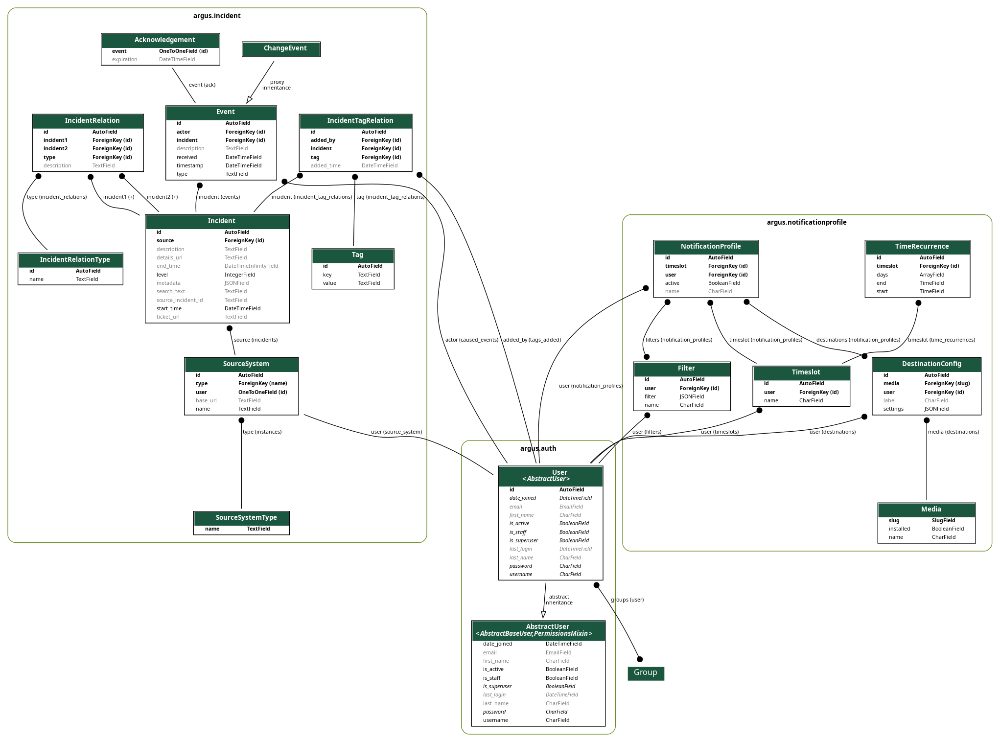

Models
------

.. _explanation-of-terms:

Explanation of terms
~~~~~~~~~~~~~~~~~~~~

Terms used in Argus are loosely based on the `ITIL standard`_ for IT service management.

-  ``incident``: an unplanned interruption in the source system.
-  ``event``: something that happened related to an incident.
-  ``acknowledgement``: an acknowledgement of an incident by a user,
   which hides the incident from the other open incidents.

   -  If ``expiration`` is an instance of ``datetime`` (for example
      ``2011-11-11T11:11:11+02:00``), the incident will be shown again
      after the expiration time.
   -  If ``expiration`` is ``null``, the acknowledgement will never
      expire.
   -  An incident is considered “acked” (acknowledged) if it has one
      or more acknowledgements that have not expired.

-  ``start_time``: the time the incident was created.
-  ``end_time``: the time the incident was resolved or closed.

   -  If the value is an instance of ``datetime``: the incident is
      stateful, and was resolved or closed at the given time. If the
      end time is in the future, the incident is considered still open.
   -  If ``null``: the incident is stateless (i.e. it cannot be closed).
   -  If ``"infinity"``: the incident is stateful, but has not yet been
      resolved or closed - for example, if it is still open.

-  ``source``: the source system that the incident originated in.
-  ``object``: the specific object that the incident is about.
-  ``parent_object``: an object that the ``object`` is a part of.
-  ``problem_type``: the type of problem that the incident is about.
-  ``tag``: a key-value pair in the form of ``key=value``.

   -  The key can consist of lowercase letters, numbers and underscores.
   -  The value can consist of any length of any characters.

-  primary key (abbreviated as ``pk`` or ``<int:pk>``): Argus uses
   “primary keys” to uniquely identify users, phone numbers, incidents,
   incident source systems, notification profiles, timeslots and
   similar.
   A primary key is a non-negative integer number. It is unique by the
   context it refers to (for example, phone numbers' ``pk``\ s are unique
   for each user).

ER diagram
~~~~~~~~~~

   ER diagram

.. _`ITIL standard`: https://en.wikipedia.org/wiki/ITIL
