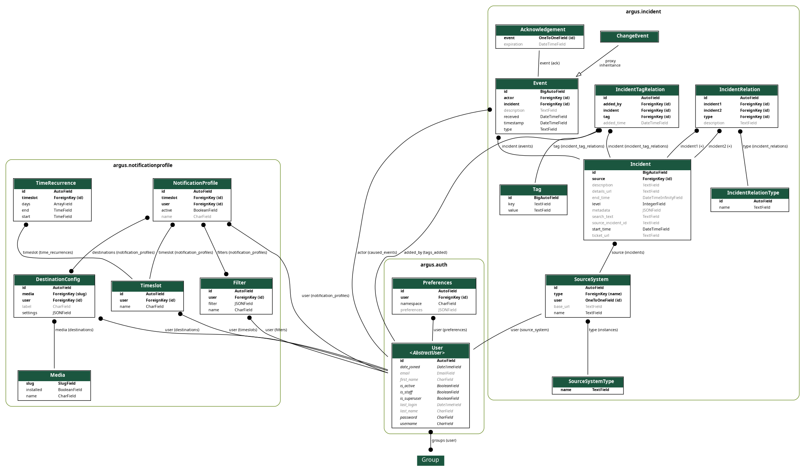

======
Models
======

Handling incidents
==================

.. glossary::

   Incident
      An :index:incident is stored in the Incident model.

   SourceSystem
      This model hosts the definition of the :index:`source` that created the
      incident.

   SourceSystemType
      A :index:`source` has a type, for easier filtering on sources. Not used
      much.

   Event
      :index:`Events <event>` on an :index:`incident` are stored in the Event
      model. The :index:`type`-field is an enum.

   Acknowledgment
      This model only hosts an optional field: :index:`expiration`, used by the
     :index: `event`-subtype :index:`Acknowldegment`.

   Tag
      An ``Incident`` may have one or more ``Tag``\s. Stored as ``key``,
      ``value`` to make for cheap lookups on either, shown everywhere as
      ``key=value``.

   Preferences
      A place to store user preferences, not yet in use. Namespaced.

   IncidentTagRelation
      Connects ``Tag``\s to their ``Incident``\s. Unnecessarily complicated,
      we haven't gotten around to simplifying it yet.

      .. note::
         We are considering removing this model but it is a very low priority.
         PR's welcome.

   IncidentRelation
      Not in use

   IncidentRelationType
      Not in use

Handling notifications
======================

.. glossary::

   NotificationProfile
      Holds the data needed for sending a :index:`notification` to a given
      :index:`destination` for a new or changed :index:`incident` that happens
      during a specified time range, the :index:`timeslot`.

   Filter
      Holds the actual :index:`filter`, stored in the field ``filter`` as JSON.
      The actual structure and validation of the JSON is customizable.

      .. note::
         We are considering moving this to a separate app since it is used for
         more than selecting which destinations to send notifications to. This'll
         take several migrations over several releases so we'd prefer to do this
         ourselves.

   Timeslot
      Holds a collection of one or more ``TimeRecurrence``\s. To cover multiple
      spans of time during the same day you need more than one
      ``TimeRecurrence``.

   TimeRecurrence
      Holds a single, continuous duration of time (via the ``start``,
      ``end``-fields) used for one or more ``days``, stored as an array of
      integers, with Monday as day 1.

   DestinationConfig
      Holds the settings for a specific :index:`destination`, in a format
      specific to that destination. Examples: phone numbers, email addresses,
      webhooks. The settings are stored in the ``settings``-field as JSON.
      Validation and serialization is handled by :index:`notification plugin`\s.

   Media
      Holds a ``DestinationConfig``'s type. The ``installed``-field is updated
      on startup to keep track of which ``notification plugin``\s are installed.

ER diagram
==========

   ER diagram
