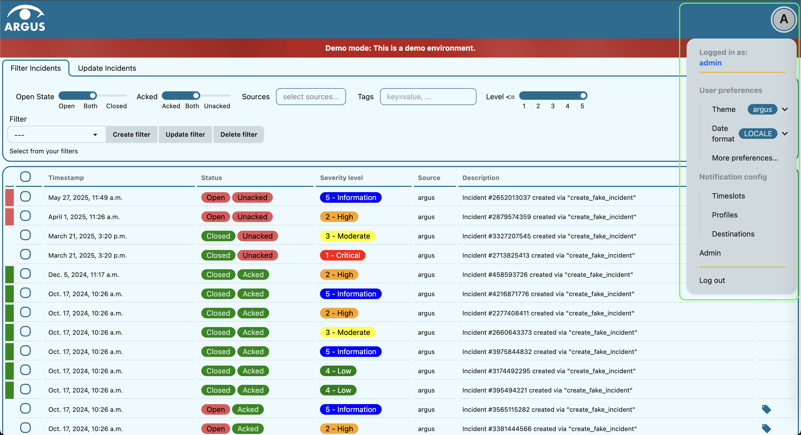

User’s guide to Argus
=====================

-  `About Argus <#what-is-argus>`_
-  `Log in <#log-into-argus>`_

   -  `Using username and
      password <#login-using-username-and-password>`_
   -  `Using OAuth
      2.0 <#login-using-oauth-20-feide-in-the-example-below>`_
   -  `Debugging network errors <#debugging-network-errors-on-login>`_

-  `Configure user settings`_
    -  `Open user menu`_
    -  `Select theme`_
    -  `Add your own theme`_
    -  `Change date and time format`_

-  `Manage alarms <#work-with-alarms-in-argus>`_

   -  `What is an incident <#what-is-an-incident-in-argus>`_
   -  `Access detailed incident view <#access-detailed-incident-view>`_
   -  `Work with table <#work-with-incidents-table>`_

      -  `Change rows per
         page <#change-how-many-rows-are-shown-per-incidents-table-page>`_
      -  `Navigate table <#navigate-incidents-table>`_
      -  `Change refresh
         interval <#change-how-often-incidents-table-gets-refreshed>`_

   -  `Filter
      incidents <#decide-which-incidents-are-shown-in-the-table>`_

      -  `Filter by open/close <#filter-by-openclose-status>`_
      -  `Filter by
         acknowledgement <#filter-by-acknowledgement-status>`_
      -  `Filter by sources <#filter-by-source-monitoring-system>`_
      -  `Filter by tags <#filter-by-tags>`_
      -  `Filter by severity level <#filter-by-severity-level>`_
      -  `Filter out old incidents <#filter-out-older-incidents>`_

   -  `Work with stored filters <#work-with-stored-filters>`_

      -  `Save filter <#save-current-filter>`_
      -  `Modify filter <#modify-existing-filter>`_
      -  `Apply filter <#apply-existing-filter>`_
      -  `Unselect applied filter <#unselect-applied-filter>`_
      -  `Delete filter <#delete-existing-filter>`_

   -  `Update one incident <#update-one-incident>`_

      -  `Re-open closed (resolved)
         incident <#re-open-a-closed-resolved-incident>`_
      -  `Close (resolve) incident <#close-resolve-an-incident>`_
      -  `Acknowledge incident <#add-acknowledgement-to-an-incident>`_
      -  `Update ticket <#update-incident-ticket>`_

         -  `Manually add ticket to
            incident <#manually-add-ticket-url-to-an-incident>`_
         -  `Edit ticket URL <#edit-ticket-url>`_
         -  `Remove ticket from
            incident <#remove-ticket-url-from-an-incident>`_
         -  `Automatically generate ticket from
            incident <#automatically-generate-ticket>`_

   -  `Update several incidents <#update-several-incidents-at-a-time>`_

      -  `Re-open incidents <#re-open-closed-resolved-incidents>`_
      -  `Close incidents <#close-resolve-incidents>`_
      -  `Acknowledge incidents <#add-acknowledgement-to-incidents>`_
      -  `Add ticket to incidents <#add-ticket-url-to-incidents>`_
      -  `Remove ticket from
         incidents <#remove-ticket-url-from-incidents>`_

-  `Customize notifications <#customize-alarm-notifications-in-argus>`_

   -  `About components of notification
      profiles <#about-components-of-notification-profiles>`_
   -  `About the available notification
      media <#about-the-available-notification-media>`_
   -  `Access your notification
      settings <#access-your-notification-profiles>`_
   -  `Add notification profile <#add-new-notification-profile>`_
   -  `Edit notification
      profile <#edit-existing-notification-profile>`_
   -  `Disable notification profile <#disable-notification-profile>`_
   -  `Delete notification profile <#delete-notification-profile>`_

-  `Manage notification
   time <#manage-when-to-receive-notifications-in-argus>`_

   -  `What is a timeslot <#what-is-a-timeslot-in-argus>`_
   -  `What is a recurrence <#what-is-a-recurrence-in-argus>`_
   -  `Access your timeslots <#access-your-timeslots>`_
   -  `Add recurrence <#add-new-recurrence>`_
   -  `Edit recurrence <#edit-recurrence>`_
   -  `Delete recurrence <#delete-recurrence>`_
   -  `Add timeslot <#add-new-timeslot>`_
   -  `Edit timeslot <#edit-existing-timeslot>`_
   -  `Delete timeslot <#delete-timeslot>`_

-  `Manage contact details
   (destinations) <#manage-your-contact-details-destinations-in-argus>`_

   -  `Access your
      destinations <#access-your-destinations-in-settings>`_
   -  `Add destination <#add-new-destination-in-settings>`_
   -  `Edit destination <#edit-existing-destination-in-settings>`_
   -  `Delete destination <#delete-destination-in-settings>`_

-  `Log out <#log-out-from-argus>`_

What is Argus?
--------------

Argus is an *alert aggregator* designed for storing and managing alerts
from different monitoring systems at one place. Argus is created for
**ease of alarm management** via **personalized interface** and **customizable alarm notifications**.

Log into Argus
--------------

Argus supports several login mechanisms:

* \ *username-password login* \
* \ *federated login with OAuth 2.0* \

Log in and start using Argus at **/accounts/login**.

Login using username and password
~~~~~~~~~~~~~~~~~~~~~~~~~~~~~~~~~

1. Fill out *username* and *password*.

2. Press ``Log in``.

Login using OAuth 2.0 (Feide in the example below)
~~~~~~~~~~~~~~~~~~~~~~~~~~~~~~~~~~~~~~~~~~~~~~~~~~

1. Under "Login with" press ``dataporten_feide``.

2. Select account you want to log in with.

3. Fill out *username* and *password* and press ``Log in``.

4. Continue with the preferred method for two-factor authentication.

Configure user settings
-----------------------

Open user menu
~~~~~~~~~~~~~~

To open user menu, click on the *user icon* in the header:

Select theme
~~~~~~~~~~~~

1. `Open user menu`_.

2. Click on the *Theme* drop-down under the *User preferences*.

3. Select the preferred theme from the drop-down menu.

Add your own theme
~~~~~~~~~~~~~~~~~~

There are 3 themes available out of the box in Argus: *Argus*, *Dark* and *Light*. You can
add your own theme by `overriding the default DAISYUI_THEMES
<https://argus-server.readthedocs.io/en/latest/customization/htmx-frontend.html#themes-and-styling>`_. \
Talk to your system administrator if you want to add your own theme.
You can either select from the `available daisyUI themes <https://daisyui.com/docs/themes/#list-of-themes>`_,
or create your own. For creating your own theme, we recommend using the
`daisyUI theme generator <https://v4.daisyui.com/theme-generator/>`_.

Change date and time format
~~~~~~~~~~~~~~~~~~~~~~~~~~~

1. `Open user menu`_.

2. Click on the *Date format* drop-down under the *User preferences*.

3. Select the preferred date format from the drop-down menu.
   The date format will be applied to all dates in Argus.
   Available options are:

    -  ``LOCALE`` - uses the date format of your browser locale.
    -  ``ISO`` - uses the ISO date format (YYYY-MM-DD HH:MM:SS).
    -  ``RFC`` - uses the RFC date format (Day, DD Mon YYYY HH:MM:SS GMT).
    -  ``EPOCH`` - uses the Unix epoch date format (seconds since 1970-01-01 00:00:00 UTC).

Work with alarms in Argus
-------------------------

**View**, **filter** and **update** alarms that come to Argus from
different sources (monitoring systems).

You can see all of your monitoring systems that are connected to Argus
in the *Sources* selector. Click on the *Sources* in the *Filter incidents*
tab and all available monitoring systems will appear in the drop-down menu.

What is an incident in Argus
~~~~~~~~~~~~~~~~~~~~~~~~~~~~

An incident is an alarm that was sent to Argus from a monitoring system
of your choice.

Each incident has a *description* (created by the monitoring system),
*start time*, *duration*, *source* (which monitoring system it came
from), *tags* and *severity level*. An incident may have *end time*,
*ticket url* (associated ticket in an external ticket system). Incidents
may have different status. For example, an incident may be *open*, or
*closed* (resolved). An incident may also be *acknowledged* (noticed or
commented in any way), or not. In the detailed incident view below you
can get familiar with the above-mentioned attributes of an incident.
Note that an incident’s event feed is also available in the detailed
view. The event feed shows events like *closing* (resolving), and
*acknowledgment* of an incident.

Each row in the *Incidents* table is one alarm. In the table you can see
an incident’s *start time*, *closed/open status*, whether an incident
has at least one *acknowledgement*, *severity level*, *source* (which
monitoring system the incident came from), *description* (created by the
monitoring system) and whether the incident has an associated *ticket
url* (label icon at the very end of the row).

Access detailed incident view
~~~~~~~~~~~~~~~~~~~~~~~~~~~~~

1. Click on an incident row in the *Incidents* table.
2. App will redirect you to the incident’s page.

Work with incidents table
~~~~~~~~~~~~~~~~~~~~~~~~~

Change how many rows are shown per incidents table page
^^^^^^^^^^^^^^^^^^^^^^^^^^^^^^^^^^^^^^^^^^^^^^^^^^^^^^^

1. Scroll down to the bottom of the *Incidents* table.

2. Click on the *Per page* drop-down.

3. Select whether you want 10/25/50/100 incidents per page displayed.

Navigate incidents table
^^^^^^^^^^^^^^^^^^^^^^^^

1. Scroll down to the bottom of the *Incidents* table.
   In the right corner, there is a set of table navigation buttons.

2. Click on the button with a *single right arrow icon* if you want to go to the next table
   page.

3. Click on the button with a *single left arrow icon* if you want to go to the previous
   table page.

4. Click on the button with a *double right arrow icon* if you want to go to the last table
   page.

5. Click on the button with a *double left arrow icon* if you want to go to the first table
   page.

Change how often incidents table gets refreshed
^^^^^^^^^^^^^^^^^^^^^^^^^^^^^^^^^^^^^^^^^^^^^^^

1. Scroll down to the bottom of the *Incidents* table.

2. Click on the *Updating every* drop-down.

3. Select whether you want incidents to be updated every 5/30/60 seconds, or Never.

Decide which incidents are shown in the table
~~~~~~~~~~~~~~~~~~~~~~~~~~~~~~~~~~~~~~~~~~~~~

For ease of alarm management you can filter incidents so that only
incidents that match all preferred parameters are shown in the
*Incidents* table.

Apply the preferred filter by using the *Filter incidents* toolbar. Argus will
remember your filter settings from the last login session, and will use
those until you change them.

*Filter incidents* toolbar is available below the header in full-screen view:

Filter by open/close status
^^^^^^^^^^^^^^^^^^^^^^^^^^^

-  If you only want *open* incidents to be displayed in the table, select
   ``Open`` in the *Open State* slider.

-  If you only want *closed* (resolved) incidents to be displayed in the
   table, select ``Closed`` in the *Open State* slider.

-  If you want both *open* and *closed* (resolved) incidents to be
   displayed in the table, press ``Both`` in the *Open State* slider.

Filter by acknowledgement status
^^^^^^^^^^^^^^^^^^^^^^^^^^^^^^^^

-  If you only want *acknowledged* incidents to be displayed in the
   table, select ``Acked`` in the *Acked* slider.

-  If you only want **un**\ *\ acknowledged* incidents to be displayed
   in the table, select ``Unacked`` in the *Acked* slider.

-  If you want both *acknowledged* and *unacknowledged* incidents to be
   displayed in the table, select ``Both`` in the *Acked* slider.

Filter by source monitoring system
^^^^^^^^^^^^^^^^^^^^^^^^^^^^^^^^^^

-  If you want the table to display only incidents that came from a
   **specific monitoring system(s)**:

   1. Click on the *Sources* selector.

   2. In the drop-down that appears, you can see all available source
      systems. Click on the preferred one. The newly selected *source system* will appear in
      the input field.

   3. Repeat the process if you want to filter by several monitoring
      systems.

-  If you want the table to display incidents from **any monitoring
   system**, leave the *Sources* field empty.

Filter by tags
^^^^^^^^^^^^^^

-  If you want the table to display only incidents that have a
   **specific tag(s)**:

   1. Type in a *tag* into the *Tags* input field in the format
      ``tag_name=tag_value``.

   2. Press *Enter*. The newly added tag will appear in the input field.

   3. Repeat the process if you want to filter by several tags, and remember to separate
      tags with a comma. For example, ``tag_name1=tag_value1, tag_name2=tag_value2``.

-  If you want the table to display incidents with **any tags**, leave
   the *Tags* field empty.

Filter by severity level
^^^^^^^^^^^^^^^^^^^^^^^^

The severity level ranges from *1 - Critical* to *5 - Information*. If
you select *max severity level* to be **5**, all incidents will be
displayed in the table. If you select *max severity level* to be **2**,
only incidents with severity **1** and **2** will be displayed in the
table.

To change *max severity level*: select the preferred *max severity* option in the *Level* slider.

Filter out older incidents
^^^^^^^^^^^^^^^^^^^^^^^^^^

Note that you can not save this parameter in `stored
filters <#work-with-stored-filters>`_.

1. Scroll down to the bottom of the *Incidents* table.

2. Click on the *Timeframe* drop-down.

3. Select the preferred option of *report-time-not-later-than* for the
   incidents in the table.

Work with stored filters
~~~~~~~~~~~~~~~~~~~~~~~~

After you `have set the preferred filter parameters for
incidents <#decide-which-incidents-are-shown-in-the-table>`_, you can
save your preferences as a *filter*. Stored *filters* can be used when
`customizing alarm
notifications <#customize-alarm-notifications-in-argus>`_.

You can save, modify, apply, unselect and delete filters in the *Filter*
selector in the *Filter incidents* toolbar:

Save current filter
^^^^^^^^^^^^^^^^^^^

1. `Set the preferred filter
   parameters <#decide-which-incidents-are-shown-in-the-table>`_.

2. Click on the *Create filter* button within the *Filter* selector.

3. Give a (meaningful) name to your filter. Press ``Submit``. Note that
   you can not edit a filter’s name after it is created.

Modify existing filter
^^^^^^^^^^^^^^^^^^^^^^

1. `Make desired changes to filter
   parameters <#decide-which-incidents-are-shown-in-the-table>`_.

2. Click on the *Update filter* button within the *Filter* selector.

3. In the drop-down menu that appears, click on the filter that you want to update.

4. Press ``Yes`` in the confirmation dialog that appears.

Apply existing filter
^^^^^^^^^^^^^^^^^^^^^

1. Click on the *Filter* selector.

2. Click on the preferred filter in the drop-down menu.

Unselect applied filter
^^^^^^^^^^^^^^^^^^^^^^^

1. Click on the *Filter* selector.

2. Click on the ``---`` option in the drop-down menu.

Delete existing filter
^^^^^^^^^^^^^^^^^^^^^^

1. Click on the *gears icon* inside the *Filter input field*.

2. Select which filter you want to delete by clicking on the *bin icon*.

3. Confirm deletion.

Update one incident
~~~~~~~~~~~~~~~~~~~

Re-open a closed (resolved) incident
^^^^^^^^^^^^^^^^^^^^^^^^^^^^^^^^^^^^

1. `Open incident in detailed view <#access-detailed-incident-view>`_.

2. Press ``Reopen incident`` at the top of the *Related events* feed.

3. Confirm re-opening. Note that you can provide a re-opening comment if
   needed.

Close (resolve) an incident
^^^^^^^^^^^^^^^^^^^^^^^^^^^

1. `Open incident in detailed view <#access-detailed-incident-view>`_.

2. Press ``Close incident`` at the top of the *Related events* feed.

3. Press ``Close now``. Note that you can provide a closing comment if
   needed.

Add acknowledgement to an incident
^^^^^^^^^^^^^^^^^^^^^^^^^^^^^^^^^^

1. `Open incident in detailed view <#access-detailed-incident-view>`_.

2. Press ``Create acknowledgement`` at the top of the *Acknowledgements* feed.

3. Provide an acknowledgement comment in the *Message* input
   field. Note that you can optionally provide a date when this
   acknowledgement is no longer relevant.

4. Press ``Submit``.

Update incident ticket
^^^^^^^^^^^^^^^^^^^^^^

Manually add ticket URL to an incident
''''''''''''''''''''''''''''''''''''''

1. `Open incident in detailed view <#access-detailed-incident-view>`_.

2. Press ``Add ticket URL`` at the bottom of the *Primary details* section.

3. Type/paste in ticket URL into the *Ticket URL* input field. Note that the
   URL has to be absolute (full website address).

4. Press ``Add ticket``.

Edit ticket URL
'''''''''''''''

1. `Open incident in detailed view <#access-detailed-incident-view>`_.

2. Press ``Edit ticket URL`` at the bottom of the *Primary details* section.

3. Type/paste in ticket URL into the *Ticket URL* input field and press
   ``Edit ticket``. Note that the URL has to be absolute (full
   website address).

Remove ticket URL from an incident
''''''''''''''''''''''''''''''''''

1. `Open incident in detailed view <#access-detailed-incident-view>`_.

2. Press ``Edit ticket URL`` at the bottom of the *Primary details* section.

3. Remove URL from the *Ticket URL* input field and press
   ``Edit ticket``.

Automatically generate ticket
'''''''''''''''''''''''''''''

Argus supports automatic ticket generation from the incident. This
feature needs additional configuration. Read more in the `Argus
documentation for ticket
systems <https://argus-server.readthedocs.io/en/latest/integrations/ticket-systems/index.html>`_.

1. `Open incident in detailed view <#access-detailed-incident-view>`_.

2. Press ``Create ticket`` at the bottom of the *Primary details* section.

3. Confirm automatic ticket generation.

4. When ticket is successfully generated, the *Ticket* field is
   updated with a new ticket URL.

Update several incidents at a time
~~~~~~~~~~~~~~~~~~~~~~~~~~~~~~~~~~

Re-open closed (resolved) incidents
^^^^^^^^^^^^^^^^^^^^^^^^^^^^^^^^^^^

1. Select several incidents in the *Incidents table* via checkbox
   at the start of the row and press ``Reopen``
   in the *Update incidents* toolbar that appears above the *Incidents table*.

2. Press ``Reopen now``. Note that you can provide a re-opening comment if
   needed.

Close (resolve) incidents
^^^^^^^^^^^^^^^^^^^^^^^^^

1. Select several incidents in the *Incidents table* via checkbox
   at the start of the row and press ``Close``
   in the *Update incidents* toolbar that appears above the *Incidents table*.

2. Press ``Close now``. Note that you can provide a closing comment if
   needed.

Add acknowledgement to incidents
^^^^^^^^^^^^^^^^^^^^^^^^^^^^^^^^

1. Select several incidents in the *Incidents table* via checkbox
   at the start of the row and press ``Acknowledge``
   in the *Update incidents* toolbar that appears above the *Incidents table*.

2. Provide an acknowledgement comment in the *Message* input
   field. Note that you can optionally provide a date when this
   acknowledgement is no longer relevant.

3. Press ``Submit``.

Add ticket URL to incidents
^^^^^^^^^^^^^^^^^^^^^^^^^^^

1. Select several incidents in the *Incidents table* via checkbox
   at the start of the row and press ``Change ticket``
   in the *Update incidents* toolbar that appears above the *Incidents table*.

2. Type/paste in ticket URL into the *Ticket URL* input field and press
   ``Submit``. Note that the URL has to be absolute (full website
   address).

Edit ticket URL for several incidents
^^^^^^^^^^^^^^^^^^^^^^^^^^^^^^^^^^^^^

Same process as `adding ticket URL to
incidents <#add-ticket-url-to-incidents>`_.

Remove ticket URL from incidents
^^^^^^^^^^^^^^^^^^^^^^^^^^^^^^^^

1. Select several incidents in the *Incidents table* via checkbox
   at the start of the row and press ``Change ticket``
   in the *Update incidents* toolbar that appears above the *Incidents table*.

2. Leave the *Ticket URL* input field empty and press ``Submit``.

Customize alarm notifications in Argus
--------------------------------------

Choose **when**, **where** and **what** alarm notifications you want to
receive by creating, editing and deleting *notification profiles*.

About components of notification profiles
~~~~~~~~~~~~~~~~~~~~~~~~~~~~~~~~~~~~~~~~~

1. **Timeslot** allows you to customize **when** you want to receive the
   alarm notifications. You can choose one timeslot per notification
   profile. Timeslots are reusable across multiple notification
   profiles.
2. **Filter** allows you to customize **what** alarms (incidents) you
   want to receive the notifications about. You can choose multiple
   filters per notification profile. Filters are reusable across
   multiple notification profiles.
3. **Destination** allows you to customize **where** you want to receive
   the alarm notifications. You can choose multiple destinations per
   notification profile. Destinations are reusable across multiple
   notification profiles. Destinations may be of `different media
   types <#about-the-available-notification-media>`_.

About the available notification media
~~~~~~~~~~~~~~~~~~~~~~~~~~~~~~~~~~~~~~

The notification media that are available in Argus by default are:

- SMS
- Email

If you wish to receive notifications to other media, read about
configurable media types in the `Argus documentation for notification
plugins <https://argus-server.readthedocs.io/en/latest/integrations/notifications/
index.html#notification-plugins-maintained-by-argus-developers-optional>`_.

Access your notification profiles
~~~~~~~~~~~~~~~~~~~~~~~~~~~~~~~~~

1. `Open user menu`_.

2. Press ``Profiles`` in the *Notification config* section.

Add new notification profile
~~~~~~~~~~~~~~~~~~~~~~~~~~~~

1. `Go to your notification
   profiles <#access-your-notification-profiles>`_.

2. Start modifying the fields in the *New Notification Profile* box at the
   top of the page:

   .. image:: img/new_notification_profile.png
      :width: 650

   - Type in a (meaningful) name for your notification profile in the
     *Name* input field.

   - Select a timeslot for when to receive notifications in the *Timeslot*
     drop-down. If the drop-down menu is empty, `create a
     timeslot <#add-new-timeslot>`_ first.

   - Select what alarms you want to receive notifications about in the
     *Filters* drop-down. If the drop-down menu is empty, `create a
     filter <#save-current-filter>`_ first. Note that if no filter is
     selected no notification will be sent. You can select multiple
     filters per notification profile.

   - Select what destination(s) you want to receive notifications to in
     the *Destinations* drop-down. If the drop-down menu is empty, `create
     a new destination <#add-new-destination-in-settings>`_ first.

3. Press ``Save``.

Edit existing notification profile
~~~~~~~~~~~~~~~~~~~~~~~~~~~~~~~~~~

1. `Go to your notification
   profiles <#access-your-notification-profiles>`_.

2. Change the name of the notification profile in the *Name* input field (if needed).

3. Change a timeslot for when to receive notifications in the *Timeslot*
   drop-down (if needed).

4. Change what alarms you want to receive notifications about in the
   *Filters* drop-down (if needed).

5. Change what destinations(s) you want to receive notifications to in
   the *Destinations* drop-down (if needed).

6. Press ``Save``.

Disable notification profile
~~~~~~~~~~~~~~~~~~~~~~~~~~~~

1. `Go to your notification
   profiles <#access-your-notification-profiles>`_.

2. Uncheck the *Active* checkbox inside one of your existing
   notification profiles.

3. Press ``Save``.

Delete notification profile
~~~~~~~~~~~~~~~~~~~~~~~~~~~

1. `Go to your notification
   profiles <#access-your-notification-profiles>`_.

2. Press ``Delete`` inside one of your existing notification profiles.

Manage when to receive notifications in Argus
---------------------------------------------

Add, edit or delete timeslots in *Timeslots*.

What is a timeslot in Argus
~~~~~~~~~~~~~~~~~~~~~~~~~~~

A timeslot is a collection of one or more recurrences with a meaningful
name. Saved timeslots can be used when `customizing alarm
notifications <#customize-alarm-notifications-in-argus>`_. Each
timeslot represents a window (or several windows) of time for when it is
OK to receive alarm notifications.

Note that every user has the default timeslot *All the time*:

.. image:: img/default_timeslot.png
  :width: 650

What is a recurrence in Argus
~~~~~~~~~~~~~~~~~~~~~~~~~~~~~

Recurrences are building blocks for timeslots. Each recurrence
represents a time range on selected weekdays for when it is OK to
receive alarm notifications. A time range can either be:

* a whole day,
* or a window of time

Each recurrence has only one time range, and it applies to all days that
are selected in a given recurrence.

For example, in this timeslot with 3 recurrences, alarm notifications
are allowed from 4 p.m. to 8 a.m. on business days (note that it is not
possible to have a recurrence that goes from one day to the next), and
all hours on weekends:

Access your timeslots
~~~~~~~~~~~~~~~~~~~~~

1. `Open user menu`_.

2. Press ``Timeslots`` in the *Notification config* section.

Add new recurrence
~~~~~~~~~~~~~~~~~~

Each timeslot must have at least one recurrence.
Add more recurrences if your timeslot needs more than
one.

1. `Go to your timeslots <#access-your-timeslots>`_.

2. Modify the ``Unsaved`` recurrence either in the *Create New Timeslot* box, or in one of
   your existing timeslots:

   .. image:: img/unsaved_recurrence.png
      :width: 650

3. Press ``Create`` if it is a new timeslot, or ``Save`` if it is an
   existing timeslot.

Edit recurrence
~~~~~~~~~~~~~~~

1. `Go to your timeslots <#access-your-timeslots>`_.

2. Modify one of the existing recurrences either in the *Create New
   Timeslot* box, or in one of your existing timeslots:

   -  If needed, change *start time* by typing a new value in format
      ``HH:MM`` (24-hour format).

   -  If needed, change *end time* by typing a new value in format
      ``HH:MM`` (24-hour format). Note that the *end time* must be later
      than the *start time*. If you want to have a recurrence that goes
      from one day to the next, you need to create two separate
      recurrences.

   -  Select day(s) via corresponding checkboxes.

Delete recurrence
~~~~~~~~~~~~~~~~~

1. `Go to your timeslots <#access-your-timeslots>`_.

2. Check the *Delete* checkbox in the top right corner inside one of the existing
   recurrences either in the *Create New Timeslot* box, or inside one of your existing timeslots.

3. Press ``Create`` if it is a new timeslot, or ``Save`` if it is an
   existing timeslot.

Add new timeslot
~~~~~~~~~~~~~~~~

1. `Go to your timeslots <#access-your-timeslots>`_.

2. Go to the *Create New Timeslot* box. It is visible by default at the top of the page
    and is highlighted with a darker background than existing timeslots.

3. Type in a (meaningful) timeslot name.

4. `Add another recurrence(s) <#add-new-recurrence>`_ if needed.

5. `Edit recurrence(s) <#edit-recurrence>`_ if needed.

6. `Remove recurrence(s) <#delete-recurrence>`_ if needed.

7. Press ``Create``.

8. The *Create New Timeslot* box will refresh to default and your newly
   created timeslot will appear at the bottom of the timeslot list. Note
   that existing timeslots have a lighter background than the *Create
   New Timeslot* box.

Edit existing timeslot
~~~~~~~~~~~~~~~~~~~~~~

1. `Go to your timeslots <#access-your-timeslots>`_.

2. Modify one of your existing timeslots:

   -  Change the name if needed.

   -  `Add another recurrence(s) <#add-new-recurrence>`_ if needed.

   -  `Edit recurrence(s) <#edit-recurrence>`_ if needed.

   -  `Remove recurrence(s) <#delete-recurrence>`_ if needed.

3. Press ``Save``.

Delete timeslot
~~~~~~~~~~~~~~~

1. `Go to your timeslots <#access-your-timeslots>`_.

2. Press ``Delete`` inside one of the existing timeslots. Note that there is no
   ``Delete``-button in the *Create New Timeslot* box.

Manage your contact details (destinations) in Argus
---------------------------------------------------

Add, edit or delete contact details, aka destinations, in your settings.
Destinations that are present in your settings can be used when
`customizing alarm
notifications <#customize-alarm-notifications-in-argus>`_.

In Argus, *emails* and *phone numbers* are the destinations that are
configured by default. If you wish to receive notifications to other
media, read about configurable media types in the `Argus documentation
for notification
plugins <https://argus-server.readthedocs.io/en/latest/integrations/notifications/
index.html#notification-plugins-maintained-by-argus-developers-optional>`_.

Access your destinations in settings
~~~~~~~~~~~~~~~~~~~~~~~~~~~~~~~~~~~~

1. `Open user menu`_.

2. Press ``Destinations`` in the *Notification config* section.

Add new destination in settings
~~~~~~~~~~~~~~~~~~~~~~~~~~~~~~~

1. `Go to your contact
   details <#access-your-destinations-in-settings>`_.

2. Go to the *Create destination* box. It is visible by default at the top of the page
   and is highlighted with a darker background than existing destinations.

3. Select destination’s media type via the *Media* drop-down.

4. Type in a title in the *Name* input field (optional)

5. Type in a destination value in the *Settings* input field (required).

6. Press ``Create``.

Edit existing destination in settings
~~~~~~~~~~~~~~~~~~~~~~~~~~~~~~~~~~~~~

1. `Go to your contact
   details <#access-your-destinations-in-settings>`_.

2. Modify one of the existing destinations (either *Name* or *Settings* value).

3. Press ``Update``.

Delete destination in settings
~~~~~~~~~~~~~~~~~~~~~~~~~~~~~~

1. `Go to your contact
   details <#access-your-destinations-in-settings>`_.

2. Press ``Delete`` inside one of your saved destinations.

Note that some destinations are connected to your Argus user profile,
and can not be deleted. In this case you will see an error message:

Log out from Argus
------------------

1. `Open user menu`_.

2. Press ``Log out``.
